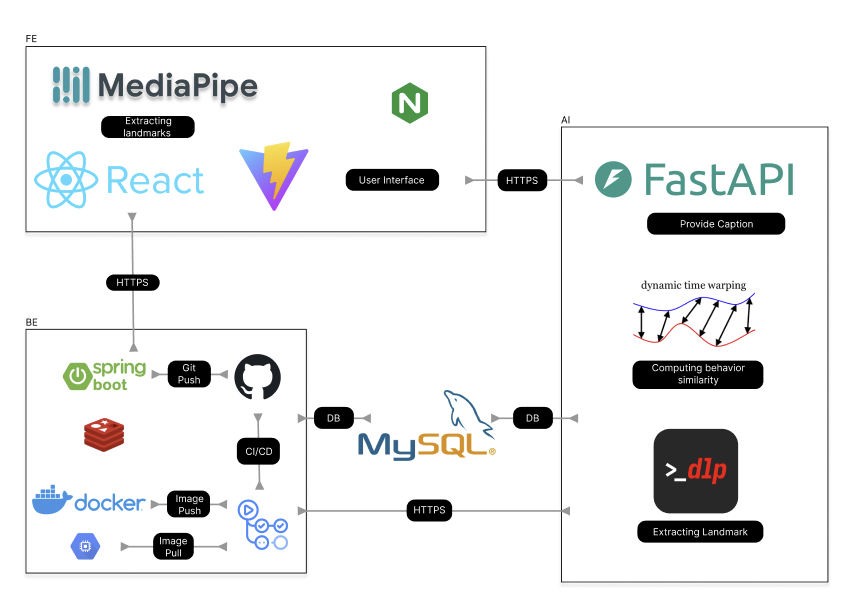
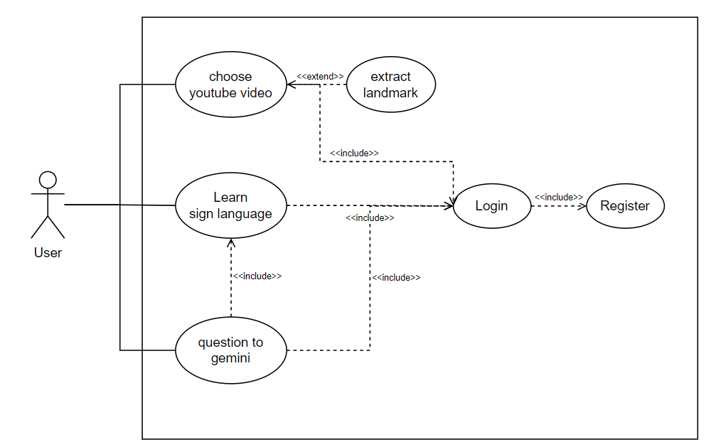

<div align="center">

## 'Signory', a sign language learning platform that learns by following along

Signory, a combination of sign and story, is a platform that lets you learn sign language by following along with sign language storybooks or sign language learning videos on YouTube.

Signory's web application-based service lowers the barrier to entry for sign language learning, and our platform digitally records and disseminates the unique language of sign language, contributing to linguistic diversity and cultural sustainability.

[**We state that this project is built for learning & educational purposes only and will not be used for commercial purposes.**]

</div>
<br>

## Participants

<div align="center">
  
 |Frontend|AI|AI|Backend|
 |:------:|:------:|:------:|:------:|
 |[](https://github.com/Moderator11)|[](https://github.com/alsgh4442)|[](https://github.com/jyj1206)|[](https://github.com/2iedo)|
 |[박수민](https://github.com/Moderator11)|[박민호](https://github.com/alsgh4442)|[정영진](https://github.com/jyj1206)|[이도훈](https://github.com/2iedo)|

</div>

## Overview

Most of sign language learning platforms only allowed users to watch and imitate simple word-based actions through videos, and there is no way to verify whether the actions are correct.

This makes it difficult for online-based sign language learners to learn what they are supposed to do and how to do it correctly.

Recently, Nvidia launched 'Signs,' a new service offering active feedback for learning American Sign Language. However, its word-based approach currently limits the variety of vocabulary available.

Our project, ‘Signory’ offers you opportunity to learn sentence-level actions through korean sign language-based videos with subtitles, and you can also check how accurate the actions are through similarity score. It's designed to handle the full vocabulary present in any Korean subtitled video, without relying on a pre-existing list.

## System Architecture



## Use Case Diagram



## Key Features

### 1. Register YouTube video-based sign language learning videos

- If there are many videos uploaded to YouTube and they have subtitles, you can use them for sign language learning. When you select a video, the AI server extracts gesture landmarks and compares them with the actual gestures to check the accuracy of the gestures during training.

### 2. Perform sign language actions for each video segment

- After selecting a video from YouTube, the video is played sentence by sentence during training, allowing you to learn sign language gestures for each sentence.

### 3. Gesture feedback via Gemini

- Users can ask Gemini for gestures with low hand language accuracy. This allows them to see the correct way to move a sentence or word, which they can follow to improve the accuracy of their sign language gestures.

## Github Link

FE : [Github](https://github.com/GDG-on-Campus-KNU/4th-SC-Team-8-FE)

AI : [Github](https://github.com/GDG-on-Campus-KNU/4th-SC-Team-8-AI)

BE : [Github](https://github.com/GDG-on-Campus-KNU/4th-SC-Team-8-BE)

# GDGoC 4th Solution Challenge Team 8 Front-End

You are currently reading english README [
[KO](./README_ko.md)
]

## Acknowledgement

We acknowledge the **potential copyright issues** associated with using YouTube video data.

> [!CAUTION]
> This project is designed solely for **educational and learning purposes** and will not be used for commercial application. Users are responsible for ensuring their use of this project complies with all applicable copyright laws and YouTube's terms of service.

## How to run

First, clone this repository into local storage.

```
git clone git@github.com:GDG-on-Campus-KNU/4th-SC-Team-8-FE.git
cd 4th-SC-Team-8-FE
```

Then create .env file with following contents.
You will need valid api key from Youtube Data v3

```
VITE_YOUTUBE_DATA_API_V3_KEY = '${YOUR_API_KEY_HERE}'
```

Reconfigure `src/shared/ServerEndpoint` and `vite.config.ts` to correctly address the BE server and AI server. Endpoint that is uploaded onto this repository is possibly deprecated and no longer accessable at the point of your testing.

Now install required packages and run

```
npm install
npm run dev
```

## Used Technologies

- React-Vite + Typescript
- MediaPipe
